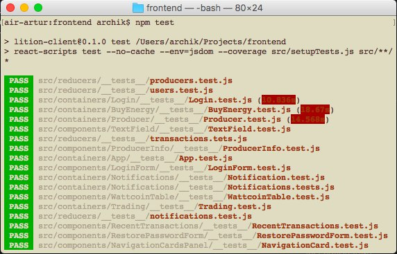
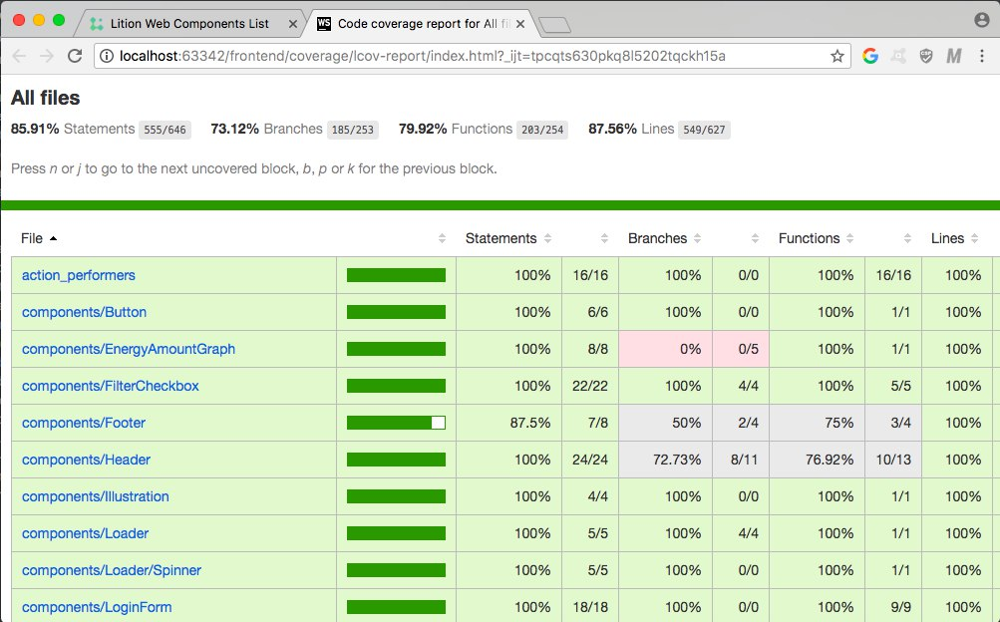
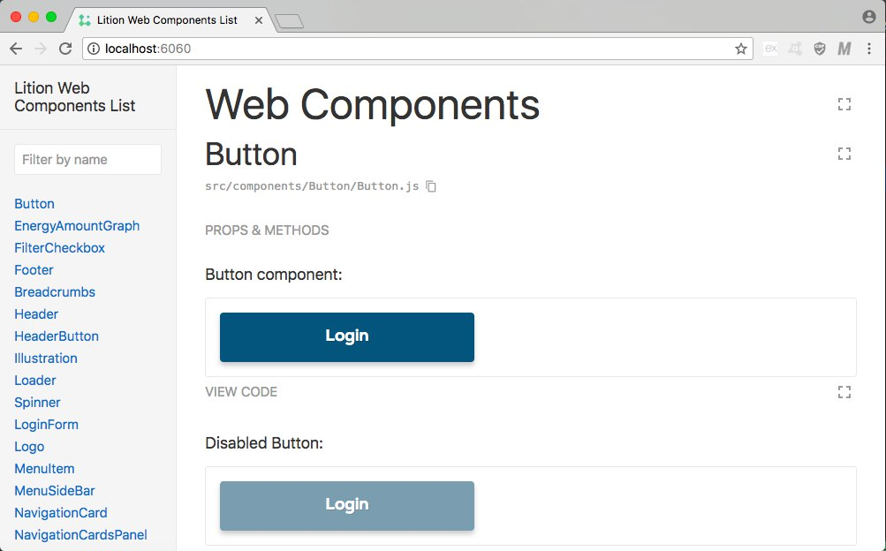

# Lition Frontend (client-side app)

This is the Frontend website that connects to the Lition backend API as specified in `https://lition.atlassian.net/wiki/spaces/LIT/pages/6160385/Application+Backend+API+Specification+Version+0.1`

After every commit to the master branch the latest version is pushed to the testing server, reachable at `https://prod.lition.io`

Deployments to the production server are done manually by Richard

## Start Project :rocket:

First step is install all application dependencies:
```
$ npm install
```

You have possibility to start standalone front-and app with local proxy server (by default `http://localhost:3000`):
```
$ npm run start
```
or build static sources for production env via following command:
```
$ npm run build
```

After that check `./build` folder.

## Developing :books:

Please, check this url for detailed information about our code rules, main technologies and external libraries: 
`https://lition.atlassian.net/wiki/spaces/LIT/pages/4685825/Front-End+Development+client-side+app`

## Testing :bar_chart:

Start unit and system tests using following command:
```
$ npm run test
```



After test completion you can check coverage report here: `./coverage/lcov-report/index.html`



## Documenting :art:

All application web components described through interactive documentation.

Run standalone documentation via following command (by default `http://localhost:6060`):
```
$ npm run styleguide
``` 

or build static files: 
```
$ npm run styleguide:build
``` 


